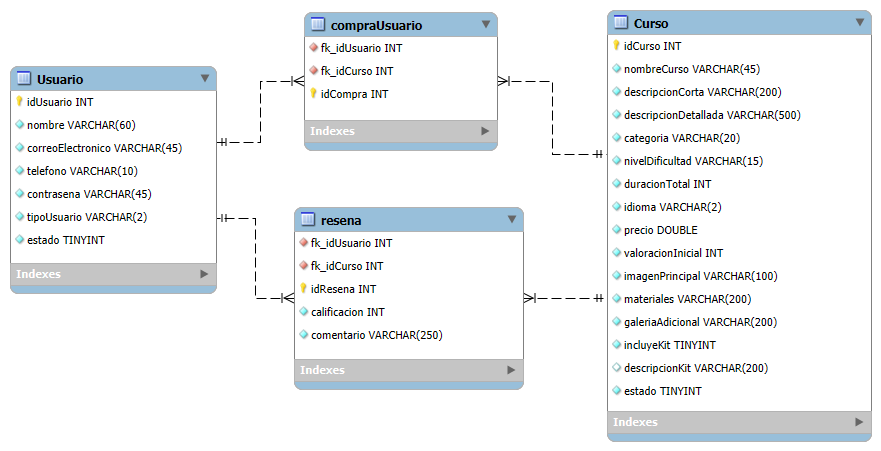

# AprendeShop — Backend

  

## 📌 Descripción
Backend de **AprendeShop** (e-commerce + learning).  
Proyecto con **Spring Boot** + **MySQL**; el frontend trabaja con **Bootstrap**.

---

## 🗂️ Diagrama de Base de Datos
> Coloca `db.png` en la raíz del repo (o ajusta la ruta).

---

## 🚀 Tecnologías
- **Java 17+**
- **Spring Boot 3.x**
- **MySQL 8.x**

---

## 🔗 Endpoints (propuesta inicial)

| Método | Ruta                         | Body (JSON)                                                | Descripción                                           |
|:------:|------------------------------|------------------------------------------------------------|-------------------------------------------------------|
| GET    | `/api/cursos`                | —                                                          | Listar cursos (acepta filtros por query params)       |
| GET    | `/api/cursos/{id}`           | —                                                          | Obtener detalle de un curso                           |
| POST   | `/api/cursos`                | `{ nombreCurso, descripcionCorta, ..., estado }`           | Crear curso *(admin)*                                 |
| PUT    | `/api/cursos/{id}`           | `{ nombreCurso?, descripcionCorta?, ..., estado? }`        | Actualizar curso *(admin)*                            |
| DELETE | `/api/cursos/{id}`           | —                                                          | Desactivar / eliminar lógico *(admin)*                |
| POST   | `/api/usuarios`              | `{ nombre, correoElectronico, telefono, contrasena }`      | Registrar usuario                                     |
| GET    | `/api/usuarios/{id}`         | —                                                          | Ver perfil de usuario                                 |
| POST   | `/api/compras`               | `{ fkIdUsuario, fkIdCurso }`                               | Registrar compra (usuario adquiere un curso)          |
| GET    | `/api/usuarios/{id}/compras` | —                                                          | Listar compras de un usuario                          |
| GET    | `/api/cursos/{id}/resenas`   | —                                                          | Listar reseñas de un curso                            |
| POST   | `/api/cursos/{id}/resenas`   | `{ fkIdUsuario, calificacion (1-5), comentario }`          | Crear reseña (requiere compra previa)                 |

> Notas:
> - `calificacion` y `valoracionInicial` trabajan en escala **0–5 / 1–5** según el caso.
